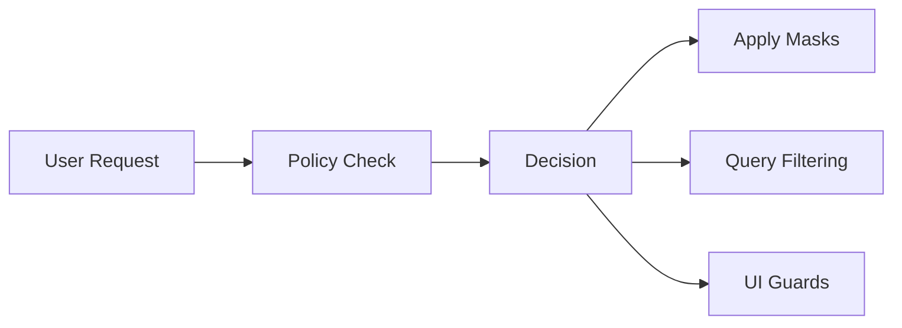

# AuthzKit Overview

AuthzKit is a type-safe policy engine that enables you to define, enforce, and manage authorization rules in TypeScript applications. This section explains the fundamental concepts that power AuthzKit.

## What is AuthzKit?

AuthzKit operates on a simple principle: **every action in your application requires explicit permission**. Instead of scattered authorization checks throughout your codebase, AuthzKit centralizes all access control logic into declarative policies.

```typescript
// Instead of this scattered throughout your app:
if (user.role !== 'admin' && user.tenantId !== post.tenantId) {
  throw new Error('Access denied')
}

// Define policies once, use everywhere:
const decision = policy.checkDetailed('viewPost', { subject: user, resource: post })
if (!decision.allow) {
  throw new Error(decision.reason)
}
```

## Key Benefits

- **Type Safety**: Full TypeScript support with compile-time validation
- **Centralized Logic**: All authorization rules in one place
- **Declarative**: Rules describe *what* is allowed, not *how* to check it
- **Field-Level Control**: Fine-grained permissions for data access
- **ORM Integration**: Automatic query scoping for Prisma, Drizzle, Kysely
- **Testable**: Easy to unit test individual authorization rules

## Architecture Overview

AuthzKit follows a simple flow:

1. **Define Actions** - Specify what users can do in your app
2. **Create Policies** - Write rules that govern access to actions
3. **Check Permissions** - Evaluate policies when users make requests
4. **Apply Results** - Use decisions to filter data and control access



## Core Components

This section covers the essential building blocks of AuthzKit:

### [Policies & Rules](/concepts/policies)
Learn how to define authorization logic with policies and rules, including rule evaluation order and best practices.

### [Actions](/concepts/actions)
Understand how actions define the "shape" of authorization requests and provide type safety.

### [Field-Level Permissions](/concepts/field-permissions)
Explore read masks and write masks for granular data access control.

### [Decisions & Attributes](/concepts/decisions)
Discover how AuthzKit returns rich decision objects with context for your application logic.

### [Type Safety](/concepts/type-safety)
See how AuthzKit provides end-to-end type safety for your authorization flow.

## Integration Patterns

Learn how AuthzKit integrates with different parts of your application:

- **Database**: Automatic query scoping with ORMs
- **APIs**: Middleware for endpoint protection
- **UI**: React components for conditional rendering
- **Testing**: Strategies for testing authorization logic

## Next Steps

Start with [Policies & Rules](/concepts/policies) to understand the foundation, then explore the other concept pages based on your needs.

Once you're comfortable with the concepts, check out our [Getting Started](/guides/getting-started) guide to implement AuthzKit in your application.