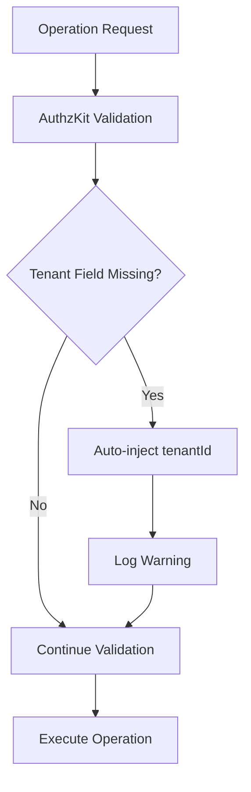

# Auto-injection

Deep dive into AuthzKit's automatic tenant field injection mechanism in assist mode.

## Overview

Auto-injection is AuthzKit's most developer-friendly feature, automatically adding missing `tenantId` fields to database operations in assist mode. This reduces boilerplate code while maintaining 100% security guarantees.

## How Auto-injection Works

When AuthzKit encounters a database operation with missing tenant fields, it:

1. **Analyzes the operation payload** recursively
2. **Identifies missing tenant fields** using generated metadata
3. **Injects the correct tenant values** automatically
4. **Logs warnings** for developer visibility
5. **Executes the modified operation** with full tenant isolation



## Simple Field Injection

### Basic Create Operations

```typescript
const tenantDb = withTenantGuard(prisma, 'tenant-123', 'assist');

// You write:
await tenantDb.user.create({
  data: {
    email: 'john@example.com',
    name: 'John Doe'
    // tenantId is missing
  }
});

// AuthzKit executes:
await prisma.user.create({
  data: {
    tenantId: 'tenant-123', // ← Auto-injected
    email: 'john@example.com',
    name: 'John Doe'
  }
});

// Console output:
// 🔧 AuthzKit INJECT_TENANT_FIELD: User.create at User.data
```

### Update Operations

```typescript
// You write:
await tenantDb.post.update({
  where: { id: 123 },
  data: {
    title: 'Updated Title',
    published: true
    // tenantId missing in data
  }
});

// AuthzKit executes:
await prisma.post.update({
  where: {
    tenantId_id: {
      tenantId: 'tenant-123', // ← Auto-injected in where
      id: 123
    }
  },
  data: {
    tenantId: 'tenant-123', // ← Auto-injected in data
    title: 'Updated Title',
    published: true
  }
});

// Console output:
// 🔧 AuthzKit INJECT_TENANT_WHERE: Post.update at Post.where
// 🔧 AuthzKit INJECT_TENANT_FIELD: Post.update at Post.data
```

## Nested Operation Injection

Auto-injection works recursively through complex nested operations:

### Nested Creates

```typescript
// Complex nested operation
await tenantDb.todo.create({
  data: {
    title: 'Plan project',
    description: 'Create detailed project plan',
    // tenantId missing here
    tags: {
      create: [
        { name: 'urgent', color: '#ff0000' },    // tenantId missing
        { name: 'planning', color: '#0066cc' }  // tenantId missing
      ]
    },
    author: {
      connect: { id: 1 } // Will use tenant-aware where clause
    }
  }
});

// AuthzKit transforms to:
await prisma.todo.create({
  data: {
    tenantId: 'tenant-123',        // ← Auto-injected
    title: 'Plan project',
    description: 'Create detailed project plan',
    tags: {
      create: [
        {
          tenantId: 'tenant-123',   // ← Auto-injected
          tag: {
            create: {
              tenantId: 'tenant-123', // ← Auto-injected
              name: 'urgent',
              color: '#ff0000'
            }
          }
        },
        {
          tenantId: 'tenant-123',   // ← Auto-injected
          tag: {
            create: {
              tenantId: 'tenant-123', // ← Auto-injected
              name: 'planning',
              color: '#0066cc'
            }
          }
        }
      ]
    },
    author: {
      connect: {
        tenantId_id: {
          tenantId: 'tenant-123',   // ← Auto-injected
          id: 1
        }
      }
    }
  }
});

// Console output:
// 🔧 AuthzKit INJECT_TENANT_FIELD: Todo.create at Todo.data
// 🔧 AuthzKit INJECT_TENANT_FIELD: TodoTag.create at Todo.data.tags.create[0]
// 🔧 AuthzKit INJECT_TENANT_FIELD: Tag.create at Todo.data.tags.create[0].tag.create
// 🔧 AuthzKit INJECT_TENANT_FIELD: TodoTag.create at Todo.data.tags.create[1]
// 🔧 AuthzKit INJECT_TENANT_FIELD: Tag.create at Todo.data.tags.create[1].tag.create
// 🔧 AuthzKit INJECT_TENANT_WHERE: User.connect at Todo.data.author.connect
```

### Many-to-Many Operations

```typescript
// Connect and create in many-to-many relationships
await tenantDb.todo.update({
  where: { id: 456 },
  data: {
    tags: {
      create: [
        { tagId: 789 } // Junction table creation - tenantId missing
      ],
      connect: [
        { id: 101 }    // Existing tag connection
      ]
    }
  }
});

// AuthzKit transforms to:
await prisma.todo.update({
  where: {
    tenantId_id: {
      tenantId: 'tenant-123', // ← Auto-injected
      id: 456
    }
  },
  data: {
    tags: {
      create: [
        {
          tenantId: 'tenant-123', // ← Auto-injected
          tagId: 789
        }
      ],
      connect: [
        {
          tenantId_id: {
            tenantId: 'tenant-123', // ← Auto-injected
            id: 101
          }
        }
      ]
    }
  }
});
```

## Where Clause Injection

AuthzKit automatically modifies where clauses to ensure tenant isolation:

### Simple Where Clauses

```typescript
// You write:
await tenantDb.user.findUnique({
  where: { id: 123 }
});

// AuthzKit executes:
await prisma.user.findUnique({
  where: {
    tenantId_id: {
      tenantId: 'tenant-123', // ← Auto-injected
      id: 123
    }
  }
});
```

### Complex Where Clauses

```typescript
// You write:
await tenantDb.post.findMany({
  where: {
    published: true,
    author: {
      email: 'john@example.com'
    }
  }
});

// AuthzKit executes:
await prisma.post.findMany({
  where: {
    tenantId: 'tenant-123',     // ← Auto-injected
    published: true,
    author: {
      tenantId: 'tenant-123',   // ← Auto-injected
      email: 'john@example.com'
    }
  }
});
```

## Injection Rules and Logic

### When Injection Occurs

Auto-injection happens when:
1. **Mode is 'assist'**: Only available in assist mode
2. **Tenant field is missing**: No explicit `tenantId` provided
3. **Field is required**: Model requires tenant field (per metadata)
4. **Rewrite is allowed**: Operation supports auto-injection

### When Injection Doesn't Occur

Auto-injection is skipped when:
1. **Tenant field already present**: Explicit value provided
2. **Strict/assert mode**: Only assist mode supports injection
3. **Model excluded**: Model not included in tenant metadata
4. **Read-only operations**: Some read operations don't require injection

### Injection Priority

AuthzKit follows a priority order for tenant field values:

1. **Explicit values**: User-provided `tenantId` values (highest priority)
2. **Context values**: Current tenant context from `withTenantGuard()`
3. **Default values**: Schema-defined defaults (if any)

```typescript
// Priority example
await tenantDb.user.create({
  data: {
    tenantId: 'explicit-tenant', // ← Priority 1: Explicit value (will cause mismatch error)
    email: 'user@example.com'
  }
});
// This will throw a tenant mismatch error because explicit value doesn't match context
```

## Configuration Options

### Enabling Auto-injection

```typescript
const tenantDb = withTenantGuard(prisma, tenantId, {
  mode: 'assist', // Required for auto-injection
  meta: tenantMeta,
  onWarn: (warning) => {
    console.log(`Auto-injection: ${warning.model}.${warning.operation} at ${warning.path}`);
  }
});
```

### Custom Warning Handlers

```typescript
const tenantDb = withTenantGuard(prisma, tenantId, {
  mode: 'assist',
  meta: tenantMeta,
  onWarn: (warning) => {
    // Custom handling based on warning code
    switch (warning.code) {
      case 'INJECT_TENANT_FIELD':
        logger.debug('Auto-injected tenant field', {
          model: warning.model,
          operation: warning.operation,
          path: warning.path
        });
        break;

      case 'INJECT_TENANT_WHERE':
        logger.debug('Auto-injected tenant constraint', {
          model: warning.model,
          operation: warning.operation,
          path: warning.path
        });
        break;

      default:
        logger.warn('Unknown AuthzKit warning', warning);
    }
  }
});
```

### Monitoring Auto-injection

```typescript
class AutoInjectionMonitor {
  private injectionCount = 0;
  private injectionsByModel = new Map<string, number>();

  onWarn = (warning: AuthzKitWarning) => {
    if (warning.code === 'INJECT_TENANT_FIELD' || warning.code === 'INJECT_TENANT_WHERE') {
      this.injectionCount++;

      const count = this.injectionsByModel.get(warning.model) || 0;
      this.injectionsByModel.set(warning.model, count + 1);

      // Alert on high injection rate
      if (this.injectionCount % 100 === 0) {
        console.warn(`High auto-injection rate: ${this.injectionCount} injections`);
      }
    }
  };

  getStats = () => ({
    total: this.injectionCount,
    byModel: Object.fromEntries(this.injectionsByModel)
  });
}

const monitor = new AutoInjectionMonitor();
const tenantDb = withTenantGuard(prisma, tenantId, {
  mode: 'assist',
  meta: tenantMeta,
  onWarn: monitor.onWarn
});
```

## Migration from Auto-injection to Explicit

### Step 1: Monitor Injection Points

```typescript
const injectionLog: Array<{
  model: string;
  operation: string;
  path: string;
  timestamp: Date;
}> = [];

const tenantDb = withTenantGuard(prisma, tenantId, {
  mode: 'assist',
  meta: tenantMeta,
  onWarn: (warning) => {
    if (warning.code === 'INJECT_TENANT_FIELD') {
      injectionLog.push({
        model: warning.model,
        operation: warning.operation,
        path: warning.path,
        timestamp: new Date()
      });
    }
  }
});

// Analyze injection patterns
const analyzeInjections = () => {
  const grouped = injectionLog.reduce((acc, item) => {
    const key = `${item.model}.${item.operation}`;
    acc[key] = (acc[key] || 0) + 1;
    return acc;
  }, {} as Record<string, number>);

  console.log('Auto-injection hotspots:');
  Object.entries(grouped)
    .sort(([, a], [, b]) => b - a)
    .forEach(([operation, count]) => {
      console.log(`${operation}: ${count} auto-injections`);
    });
};
```

### Step 2: Add Explicit Fields

Replace auto-injected fields with explicit ones:

```typescript
// Before (with auto-injection)
await tenantDb.user.create({
  data: {
    email: 'user@example.com',
    name: 'User Name'
    // tenantId auto-injected
  }
});

// After (explicit)
await tenantDb.user.create({
  data: {
    tenantId: currentTenantId, // ← Now explicit
    email: 'user@example.com',
    name: 'User Name'
  }
});
```

### Step 3: Test with Strict Mode

```typescript
// Test explicit implementation with strict mode
const strictTenantDb = withTenantGuard(prisma, tenantId, 'strict');

try {
  // Run operations that previously relied on auto-injection
  await strictTenantDb.user.create({
    data: {
      tenantId: currentTenantId,
      email: 'user@example.com',
      name: 'User Name'
    }
  });
  console.log('✅ Explicit implementation working');
} catch (error) {
  console.error('❌ Still relying on auto-injection:', error.message);
}
```

## Performance Considerations

### Auto-injection Overhead

Auto-injection adds minimal overhead:
- **Payload analysis**: O(N) where N is payload size
- **Field injection**: O(1) per missing field
- **Metadata lookup**: O(1) with cached metadata

### Optimization Tips

1. **Use explicit fields** for frequently called operations
2. **Monitor injection frequency** to identify optimization opportunities
3. **Cache tenant clients** to avoid repeated metadata processing
4. **Minimize nested operation depth** for complex payloads

### Benchmarking Auto-injection

```typescript
import { performance } from 'perf_hooks';

const benchmarkAutoInjection = async () => {
  const assistDb = withTenantGuard(prisma, tenantId, 'assist');
  const strictDb = withTenantGuard(prisma, tenantId, 'strict');

  // Benchmark auto-injection
  const start1 = performance.now();
  await assistDb.user.create({
    data: {
      email: 'auto@example.com',
      name: 'Auto User'
      // tenantId auto-injected
    }
  });
  const autoInjectionTime = performance.now() - start1;

  // Benchmark explicit
  const start2 = performance.now();
  await strictDb.user.create({
    data: {
      tenantId: tenantId,
      email: 'explicit@example.com',
      name: 'Explicit User'
    }
  });
  const explicitTime = performance.now() - start2;

  console.log(`Auto-injection: ${autoInjectionTime.toFixed(2)}ms`);
  console.log(`Explicit: ${explicitTime.toFixed(2)}ms`);
  console.log(`Overhead: ${(autoInjectionTime - explicitTime).toFixed(2)}ms`);
};
```

## Common Patterns

### Repository Pattern with Auto-injection

```typescript
class UserRepository {
  constructor(private tenantDb: TenantDb) {}

  async create(userData: { email: string; name: string }) {
    return this.tenantDb.user.create({
      data: userData // tenantId auto-injected
    });
  }

  async update(id: number, userData: Partial<{ email: string; name: string }>) {
    return this.tenantDb.user.update({
      where: { id }, // tenant constraint auto-injected
      data: userData // tenantId auto-injected if needed
    });
  }
}
```

### Service Layer with Mixed Approach

```typescript
class TodoService {
  constructor(private tenantDb: TenantDb) {}

  // Hot path - explicit for performance
  async createTodo(data: { title: string; authorId: number }) {
    return this.tenantDb.todo.create({
      data: {
        tenantId: this.tenantDb.tenantId, // Explicit
        ...data
      }
    });
  }

  // Complex operation - let auto-injection handle it
  async createTodoWithTags(data: { title: string; authorId: number; tags: string[] }) {
    return this.tenantDb.todo.create({
      data: {
        title: data.title,
        authorId: data.authorId,
        // tenantId auto-injected
        tags: {
          create: data.tags.map(name => ({
            tag: {
              create: { name, color: '#default' }
              // tenantId auto-injected recursively
            }
          }))
        }
      }
    });
  }
}
```

---

**Next: [Nested Operations](/tenant-guard/nested-operations)** - Learn how AuthzKit handles complex nested database operations.