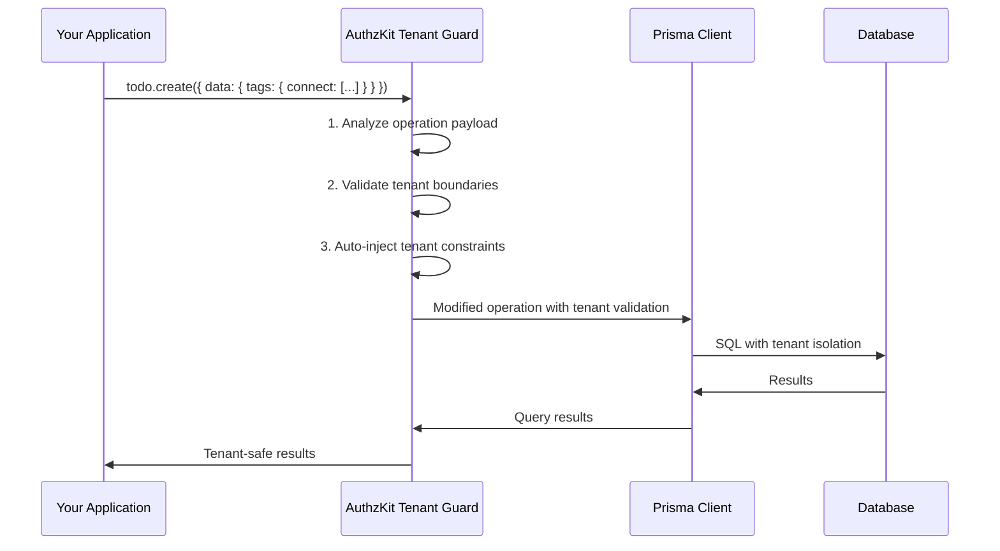

# Core Concepts

Understanding the fundamental concepts behind AuthzKit Tenant Guard's automatic protection mechanisms.

## The Multi-tenant Security Problem

Multi-tenant applications face a critical challenge: ensuring that every database operation respects tenant boundaries. Consider this seemingly simple operation:

```typescript
// What seems like a simple todo update...
await prisma.todo.update({
  where: { id: todoId },
  data: {
    tags: {
      connect: [{ id: tagId }] // ⚠️ What if tagId belongs to another tenant?
    }
  }
});
```

**The Hidden Complexity:**
- Is `todoId` from the correct tenant?
- Does `tagId` belong to the same tenant as the todo?
- What about nested operations in complex data structures?
- How do you validate this in every single operation?

Traditional solutions require developers to manually validate every operation, leading to:
- **Human error risk**: Easy to forget validation in complex nested operations
- **Security vulnerabilities**: Single oversight can compromise the entire system
- **Development overhead**: Significant boilerplate code for every database interaction

## AuthzKit's Solution: Security by Construction

AuthzKit transforms this manual, error-prone process into an **automatic guarantee**. Instead of relying on developer discipline, AuthzKit makes cross-tenant violations **impossible by construction**.

### Core Principle: Impossible vs. Unlikely

Traditional approaches make security violations *unlikely* through careful coding:
```typescript
// Traditional approach - relies on developer remembering
if (tag.tenantId !== currentTenantId) {
  throw new Error('Cross-tenant access denied');
}
if (todo.tenantId !== currentTenantId) {
  throw new Error('Cross-tenant access denied');
}
// ... must be repeated everywhere
```

AuthzKit makes security violations **impossible**:
```typescript
// AuthzKit approach - automatic protection
const tenantDb = withTenantGuard(prisma, tenantId);
// ALL operations are now automatically protected
```

## How AuthzKit Works

AuthzKit operates as a Prisma Client extension that intercepts and validates all database operations before they reach the database.



### The Four Pillars of Protection

#### 1. Automatic Tenant Field Injection

AuthzKit automatically injects the correct `tenantId` into all operations:

```typescript
// You write:
await tenantDb.user.create({
  data: {
    email: 'user@example.com',
    name: 'John Doe'
  }
});

// AuthzKit transforms to:
await prisma.user.create({
  data: {
    tenantId: 'current-tenant-id', // ← Auto-injected
    email: 'user@example.com',
    name: 'John Doe'
  }
});
```

#### 2. Where Clause Modification

AuthzKit modifies query constraints to enforce tenant boundaries:

```typescript
// You write:
await tenantDb.todo.findUnique({ where: { id: 123 } });

// AuthzKit transforms to:
await prisma.todo.findUnique({
  where: {
    tenantId_id: {
      tenantId: 'current-tenant-id', // ← Auto-injected constraint
      id: 123
    }
  }
});
```

#### 3. Nested Operation Validation

AuthzKit validates ALL nested operations recursively:

```typescript
// Complex nested operation
await tenantDb.todo.create({
  data: {
    title: 'New Task',
    tags: {
      create: [
        { name: 'urgent', color: '#ff0000' }
      ],
      connect: [
        { id: existingTagId } // ← AuthzKit validates this belongs to correct tenant
      ]
    }
  }
});
```

AuthzKit walks through the entire operation tree and validates every nested create, connect, update, and delete operation.

#### 4. Relationship Constraint Enforcement

AuthzKit ensures all relationship operations respect tenant boundaries:

```typescript
// This will be blocked if the tag belongs to another tenant
await tenantDb.todoTag.create({
  data: {
    todoId: 123,
    tagId: 456 // ← AuthzKit validates both todo and tag belong to current tenant
  }
});
```

## Tenant Metadata: The Foundation

AuthzKit's protection is powered by automatically generated metadata that describes your schema's tenant relationships.

### Generated Metadata Structure

```json
{
  "Todo": {
    "tenantField": "tenantId",
    "compositeSelector": "tenantId_id",
    "nestedTargets": {
      "author": "User",
      "tags": "TodoTag"
    }
  },
  "TodoTag": {
    "tenantField": "tenantId",
    "compositeSelector": "tenantId_todoId_tagId",
    "nestedTargets": {
      "todo": "Todo",
      "tag": "Tag"
    }
  }
}
```

### Metadata Components

- **`tenantField`**: The field that contains the tenant identifier
- **`compositeSelector`**: The composite unique constraint for efficient tenant-aware queries
- **`nestedTargets`**: Maps relationship fields to their target models

This metadata enables AuthzKit to:
1. Identify which fields need tenant validation
2. Understand relationship structures
3. Generate appropriate constraints
4. Validate nested operations correctly

## Operation Modes

AuthzKit supports different operation modes for different environments and security requirements:

### Assist Mode (Development)

```typescript
const tenantDb = withTenantGuard(prisma, tenantId, 'assist');
```

**Behavior:**
- Auto-injects missing tenant fields
- Provides warning logs for visibility
- Graceful handling reduces development friction

**Use cases:**
- Development environments
- Rapid prototyping
- Learning AuthzKit behavior

### Strict Mode (Production)

```typescript
const tenantDb = withTenantGuard(prisma, tenantId, 'strict');
```

**Behavior:**
- Requires explicit tenant field specification
- Throws errors for missing tenant fields
- No hidden auto-injection behavior

**Use cases:**
- Production environments
- Code reviews and quality assurance
- Explicit validation requirements

### Assert Mode (Experimental)

```typescript
const tenantDb = withTenantGuard(prisma, tenantId, 'assert');
```

**Behavior:**
- Enhanced validation checks
- Advanced tenant boundary verification
- Experimental features

**Use cases:**
- Advanced validation scenarios
- Future enhancement platform

## The Validation Pipeline

Understanding how AuthzKit validates operations helps you design better multi-tenant applications.

### Step 1: Operation Interception

When you call a Prisma operation through AuthzKit:

```typescript
await tenantDb.todo.create({
  data: {
    title: 'Task',
    tags: { connect: [{ id: 123 }] }
  }
});
```

AuthzKit intercepts this before it reaches Prisma.

### Step 2: Payload Analysis

AuthzKit recursively analyzes the operation payload:

```typescript
{
  operation: 'create',
  model: 'Todo',
  data: {
    title: 'Task',           // ← Regular field (no validation needed)
    tags: {                  // ← Nested operation (needs validation)
      connect: [{ id: 123 }] // ← Cross-model reference (critical validation)
    }
  }
}
```

### Step 3: Tenant Validation

For each part of the operation, AuthzKit:

1. **Identifies tenant-relevant fields** using metadata
2. **Validates existing tenant values** match the current tenant
3. **Auto-injects missing tenant fields** (in assist mode)
4. **Validates cross-model references** ensure tenant consistency

### Step 4: Query Transformation

AuthzKit transforms the operation to include proper tenant constraints:

```typescript
// Original operation
{ where: { id: 123 } }

// Transformed operation
{
  where: {
    tenantId_id: {
      tenantId: 'current-tenant',
      id: 123
    }
  }
}
```

### Step 5: Execution and Results

The transformed operation executes with guaranteed tenant isolation.

## Schema Design Patterns

AuthzKit works with standard multi-tenant schema patterns:

### Pattern 1: Shared Database, Shared Tables

```prisma
model User {
  id       Int    @id @default(autoincrement())
  tenantId String // Tenant isolation field
  email    String
  posts    Post[]

  @@unique([tenantId, id], map: "tenantId_id")
  @@unique([tenantId, email], map: "tenantId_email")
}

model Post {
  id       Int    @id @default(autoincrement())
  tenantId String // Tenant isolation field
  title    String
  authorId Int
  author   User @relation(fields: [authorId, tenantId], references: [id, tenantId])

  @@unique([tenantId, id], map: "tenantId_id")
}
```

### Pattern 2: Many-to-Many with Tenant Isolation

```prisma
model Todo {
  id       Int       @id @default(autoincrement())
  tenantId String
  title    String
  tags     TodoTag[]

  @@unique([tenantId, id])
}

model Tag {
  id       Int       @id @default(autoincrement())
  tenantId String
  name     String
  todos    TodoTag[]

  @@unique([tenantId, id])
}

model TodoTag {
  tenantId String
  todoId   Int
  tagId    Int
  todo     Todo @relation(fields: [todoId, tenantId], references: [id, tenantId])
  tag      Tag  @relation(fields: [tagId, tenantId], references: [id, tenantId])

  @@id([tenantId, todoId, tagId])
}
```

### Pattern 3: Hierarchical Tenancy

```prisma
model Organization {
  id       String @id
  name     String
  parentId String?
  parent   Organization? @relation("OrgHierarchy", fields: [parentId], references: [id])
  children Organization[] @relation("OrgHierarchy")
}

model User {
  id       Int    @id @default(autoincrement())
  tenantId String // Maps to Organization.id
  email    String

  @@unique([tenantId, id])
}
```

## Error Handling and Debugging

### Understanding AuthzKit Errors

AuthzKit provides detailed error messages for debugging:

```typescript
TenantGuardError: Tenant guard: missing tenant field for TodoTag.create
Operation: todos.create.data.tags.create[0]
Expected tenant field: tenantId
```

**Error Components:**
- **Error type**: `TenantGuardError`
- **Issue description**: Missing tenant field
- **Model and operation**: `TodoTag.create`
- **Operation path**: Exact location in nested operation
- **Expected field**: What field was missing

### Debugging Tips

1. **Check operation paths**: AuthzKit shows exactly where violations occur
2. **Verify metadata generation**: Ensure `.prisma/tenant-guard/` exists
3. **Review schema constraints**: Confirm composite unique constraints
4. **Test with different modes**: Use assist mode for debugging

## Performance Considerations

### Minimal Runtime Overhead

AuthzKit is designed for production performance:

- **O(N) complexity**: Linear with operation payload size
- **No additional database queries**: All validation happens in-memory
- **Cached metadata**: Schema metadata loaded once at startup
- **Efficient transformations**: Minimal object manipulation

### Memory Usage

- **Metadata size**: Proportional to schema complexity
- **Operation validation**: Temporary objects during validation
- **No persistent state**: AuthzKit is stateless between operations

### Optimization Strategies

1. **Reuse tenant clients**: Create tenant clients once per request
2. **Cache metadata**: Load metadata once at application startup
3. **Use strict mode in production**: Avoid auto-injection overhead
4. **Monitor operation complexity**: Complex nested operations take longer to validate

## Integration with Database Features

### PostgreSQL Row-Level Security (RLS)

AuthzKit can work with PostgreSQL RLS for defense in depth:

```sql
-- Database-level policies that work with AuthzKit
CREATE POLICY "tenant_isolation" ON "User"
  USING (current_setting('authzkit.tenant_id', true) = "tenantId");
```

```typescript
// AuthzKit sets the session variable automatically
const tenantDb = withTenantGuard(prisma, tenantId, {
  rls: {
    enabled: true,
    varName: 'authzkit.tenant_id'
  }
});
```

### Foreign Key Constraints

AuthzKit leverages database foreign key constraints:

```prisma
model Post {
  author User @relation(fields: [authorId, tenantId], references: [id, tenantId])
  //                   ^^^^^^^^^^^^^^^^^^^^^^^^^^^^^^^^^^^^^^^^^^^^^^^^^^^^^^^^
  //                   Composite foreign key includes tenant field
}
```

Even if AuthzKit validation is bypassed, the database prevents cross-tenant relationships.

## Summary

AuthzKit Tenant Guard provides comprehensive multi-tenant security through:

1. **Automatic tenant field injection** - Ensures all data belongs to the correct tenant
2. **Where clause modification** - Prevents access to other tenants' data
3. **Nested operation validation** - Validates complex operations recursively
4. **Relationship constraint enforcement** - Maintains tenant boundaries across all relationships

This approach makes cross-tenant security violations **impossible by construction**, not just unlikely through careful coding.

The result is a multi-tenant application where developers can focus on business logic while AuthzKit handles security automatically and transparently.

---

**Next: [Auto-injection](/tenant-guard/auto-injection)** - Deep dive into AuthzKit's automatic tenant field injection.