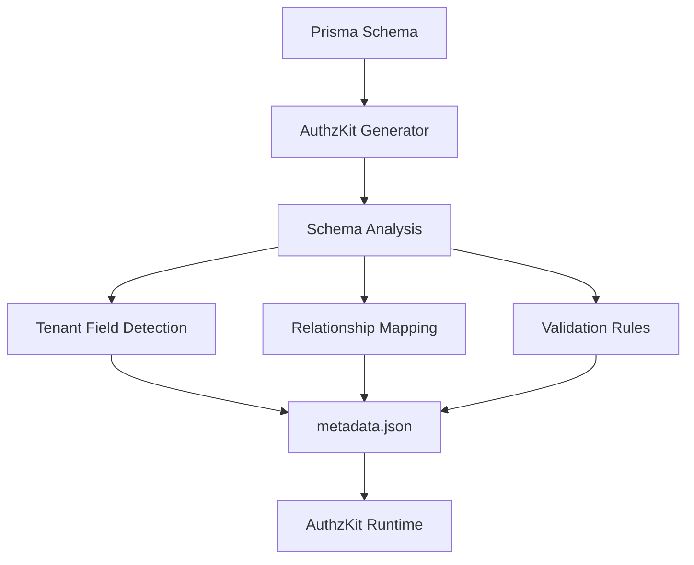

# AuthzKit Tenant Guard Generator

The AuthzKit Tenant Guard Generator is a Prisma generator that automatically analyzes your database schema and creates the metadata required for runtime tenant isolation. It's the foundation that makes AuthzKit's automatic protection possible.

## Overview

The generator scans your Prisma schema and produces:
- **Runtime metadata**: JSON configuration for the AuthzKit runtime
- **TypeScript definitions**: Type-safe metadata interfaces
- **Schema analysis**: Tenant field detection and relationship mapping
- **Validation rules**: Automatic validation configuration

## How It Works



## Installation

Add the generator to your `schema.prisma` file:

```prisma
generator client {
  provider = "prisma-client-js"
}

generator tenantGuard {
  provider = "@authzkit/prisma-tenant-guard-generator"
}
```

## Generated Files

When you run `npx prisma generate`, the AuthzKit generator creates:

```
.prisma/
├── client/           # Standard Prisma client
└── tenant-guard/     # AuthzKit metadata
    ├── meta.json     # Runtime metadata
    └── meta.ts       # TypeScript definitions
```

### metadata.json Structure

```json
{
  "User": {
    "tenantField": "tenantId",
    "compositeSelector": "tenantId_id",
    "nestedTargets": {
      "posts": "Post"
    }
  },
  "Post": {
    "tenantField": "tenantId",
    "compositeSelector": "tenantId_id",
    "nestedTargets": {
      "author": "User",
      "comments": "Comment"
    }
  },
  "Comment": {
    "tenantField": "tenantId",
    "compositeSelector": "tenantId_id",
    "nestedTargets": {
      "post": "Post",
      "author": "User"
    }
  }
}
```

### TypeScript Definitions

```typescript
// .prisma/tenant-guard/meta.ts
export interface TenantMeta {
  [modelName: string]: {
    tenantField: string;
    compositeSelector: string;
    nestedTargets: Record<string, string>;
  };
}

export const tenantMeta: TenantMeta = {
  // ... metadata content
};
```

## Schema Analysis

### Tenant Field Detection

The generator automatically detects tenant fields in your models:

```prisma
model User {
  id       Int    @id @default(autoincrement())
  tenantId String // ← Automatically detected as tenant field
  email    String
  name     String

  @@unique([tenantId, id], map: "tenantId_id")
}
```

**Detection Rules:**
1. Fields named `tenantId` are automatically detected
2. Custom tenant field names can be configured
3. Must be part of a composite unique constraint
4. Must be present in foreign key relationships

### Relationship Mapping

The generator maps all relationships that cross tenant boundaries:

```prisma
model Post {
  id       Int    @id @default(autoincrement())
  tenantId String
  title    String
  authorId Int

  // Generator maps this relationship
  author User @relation(fields: [authorId, tenantId], references: [id, tenantId])
}
```

**Mapping Process:**
1. Identifies all `@relation` attributes
2. Extracts tenant-aware foreign keys
3. Maps nested operation targets
4. Creates validation rules for connections

### Composite Selector Generation

For efficient tenant-aware queries, the generator creates composite selectors:

```prisma
model User {
  @@unique([tenantId, id], map: "tenantId_id") // ← Used as composite selector
}
```

Generated selector: `"tenantId_id"`

Used in runtime queries:
```typescript
await prisma.user.findUnique({
  where: {
    tenantId_id: {
      tenantId: "tenant-123",
      id: 456
    }
  }
});
```

## Configuration Options

### Custom Tenant Field Names

Configure custom tenant field names:

```prisma
generator tenantGuard {
  provider    = "@authzkit/prisma-tenant-guard-generator"
  tenantField = "organizationId" // Custom tenant field name
}

model User {
  id             Int    @id @default(autoincrement())
  organizationId String // Custom tenant field
  email          String
  name           String

  @@unique([organizationId, id], map: "organizationId_id")
}
```

### Output Configuration

Customize output location and format:

```prisma
generator tenantGuard {
  provider   = "@authzkit/prisma-tenant-guard-generator"
  output     = "./generated/tenant-guard"     // Custom output directory
  jsonOutput = "./config/tenant-meta.json"   // Custom JSON location
  tsOutput   = "./types/tenant-meta.ts"       // Custom TypeScript location
}
```

### Exclusions

Exclude specific models from tenant guard protection:

```prisma
generator tenantGuard {
  provider = "@authzkit/prisma-tenant-guard-generator"
  exclude  = ["SystemLog", "GlobalConfig"] // Models to exclude
}

model SystemLog {
  id        Int      @id @default(autoincrement())
  message   String
  timestamp DateTime @default(now())
  // No tenantId - excluded from tenant guard
}
```

## Advanced Features

### Multi-tenant Schema Patterns

#### Pattern 1: Standard Multi-tenant

```prisma
model User {
  id       Int    @id @default(autoincrement())
  tenantId String
  email    String
  posts    Post[]

  @@unique([tenantId, id])
  @@unique([tenantId, email]) // Unique email per tenant
}

model Post {
  id       Int    @id @default(autoincrement())
  tenantId String
  title    String
  authorId Int
  author   User @relation(fields: [authorId, tenantId], references: [id, tenantId])

  @@unique([tenantId, id])
}
```

#### Pattern 2: Hierarchical Tenancy

```prisma
model Organization {
  id       String @id
  name     String
  parentId String?
  parent   Organization? @relation("OrgHierarchy", fields: [parentId], references: [id])
  children Organization[] @relation("OrgHierarchy")
  users    User[]
}

model User {
  id       Int    @id @default(autoincrement())
  tenantId String // Maps to Organization.id
  orgId    String
  email    String
  org      Organization @relation(fields: [orgId], references: [id])

  @@unique([tenantId, id])
}
```

#### Pattern 3: Many-to-Many with Tenant Isolation

```prisma
model Todo {
  id       Int       @id @default(autoincrement())
  tenantId String
  title    String
  tags     TodoTag[]

  @@unique([tenantId, id])
}

model Tag {
  id       Int       @id @default(autoincrement())
  tenantId String
  name     String
  todos    TodoTag[]

  @@unique([tenantId, id])
}

model TodoTag {
  tenantId String
  todoId   Int
  tagId    Int
  todo     Todo @relation(fields: [todoId, tenantId], references: [id, tenantId])
  tag      Tag  @relation(fields: [tagId, tenantId], references: [id, tenantId])

  @@id([tenantId, todoId, tagId])
}
```

### Generator Metadata Analysis

The generator performs deep analysis of your schema:

#### 1. Relationship Direction Detection

```typescript
// Generated metadata includes relationship directions
{
  "Todo": {
    "tenantField": "tenantId",
    "nestedTargets": {
      "tags": "TodoTag",      // One-to-many relationship
      "author": "User"        // Many-to-one relationship
    }
  }
}
```

#### 2. Circular Relationship Handling

```prisma
model User {
  id        Int    @id @default(autoincrement())
  tenantId  String
  managerId Int?
  manager   User?  @relation("UserManager", fields: [managerId, tenantId], references: [id, tenantId])
  reports   User[] @relation("UserManager")
}
```

Generator handles circular references safely:
```typescript
{
  "User": {
    "tenantField": "tenantId",
    "nestedTargets": {
      "manager": "User",  // Self-reference handled
      "reports": "User"   // Circular relationship mapped
    }
  }
}
```

#### 3. Optional Relationship Detection

```prisma
model Post {
  id         Int       @id @default(autoincrement())
  tenantId   String
  categoryId Int?
  category   Category? @relation(fields: [categoryId, tenantId], references: [id, tenantId])
}
```

Metadata includes optionality information:
```typescript
{
  "Post": {
    "tenantField": "tenantId",
    "nestedTargets": {
      "category": "Category" // Optional relationship preserved
    }
  }
}
```

## Debugging Generator Output

### Verbose Mode

Enable verbose logging to debug generator behavior:

```prisma
generator tenantGuard {
  provider = "@authzkit/prisma-tenant-guard-generator"
  verbose  = true
}
```

Output during generation:
```
🔍 AuthzKit Generator: Analyzing schema...
📊 Found 5 models with tenant fields
🔗 Mapping 12 tenant-aware relationships
📝 Generating metadata for models: User, Post, Comment, Tag, TodoTag
✅ Generated metadata: .prisma/tenant-guard/meta.json
✅ Generated types: .prisma/tenant-guard/meta.ts
```

### Validation Warnings

The generator provides warnings for common issues:

```
⚠️  AuthzKit Warning: Model 'Post' has tenantId but no composite unique constraint
⚠️  AuthzKit Warning: Relationship 'User.posts' missing tenantId in foreign key
⚠️  AuthzKit Warning: Model 'GlobalConfig' has no tenant field - excluding from metadata
```

### Schema Validation

The generator validates your schema for tenant guard compatibility:

```typescript
// Generator checks for these patterns:
- ✅ Tenant field present in model
- ✅ Composite unique constraint with tenant field
- ✅ Foreign keys include tenant field
- ✅ Relationship directions are valid
- ⚠️  Warns about non-compliant patterns
```

## Integration with Build Systems

### NPM Scripts

```json
{
  "scripts": {
    "generate": "prisma generate",
    "generate:watch": "prisma generate --watch",
    "postinstall": "prisma generate"
  }
}
```

### Docker Builds

```dockerfile
FROM node:18-alpine

WORKDIR /app

# Copy Prisma schema first
COPY prisma ./prisma/
COPY package*.json ./

RUN npm ci

# Generate Prisma client and AuthzKit metadata
RUN npx prisma generate

COPY . .
RUN npm run build

CMD ["npm", "start"]
```

### CI/CD Integration

```yaml
# GitHub Actions
- name: Generate Prisma Client and AuthzKit Metadata
  run: |
    npx prisma generate
    ls -la .prisma/tenant-guard/ # Verify files were created

- name: Verify AuthzKit Metadata
  run: |
    node -e "
      const meta = require('./.prisma/tenant-guard/meta.json');
      console.log('Generated metadata for models:', Object.keys(meta));
      if (Object.keys(meta).length === 0) {
        throw new Error('No tenant guard metadata generated');
      }
    "
```

## Troubleshooting Generator Issues

### Common Problems

#### 1. No Metadata Generated

**Problem**: Generator runs but produces empty metadata

**Causes**:
- No models with `tenantId` fields
- Missing composite unique constraints
- Models excluded from generation

**Solution**:
```prisma
// Ensure models have tenant fields and constraints
model User {
  id       Int    @id @default(autoincrement())
  tenantId String // ← Required
  email    String

  @@unique([tenantId, id]) // ← Required constraint
}
```

#### 2. Relationship Mapping Errors

**Problem**: Relationships not properly mapped

**Causes**:
- Foreign keys missing tenant field
- Incorrect relationship definitions

**Solution**:
```prisma
model Post {
  authorId Int
  tenantId String
  // Include tenantId in relationship
  author User @relation(fields: [authorId, tenantId], references: [id, tenantId])
  //                              ^^^^^^^^                    ^^^^^^^^
}
```

#### 3. TypeScript Import Errors

**Problem**: Cannot import generated metadata

**Causes**:
- Generation failed
- Incorrect import path
- TypeScript configuration issues

**Solution**:
```typescript
// Check file exists
import tenantMeta from '../.prisma/tenant-guard/meta.json' assert { type: 'json' };

// Or use dynamic import
const tenantMeta = await import('../.prisma/tenant-guard/meta.json');
```

## Best Practices

### 1. Schema Design

- Always include `tenantId` in composite unique constraints
- Include `tenantId` in all foreign key relationships
- Use consistent naming for tenant fields
- Design for tenant isolation from the start

### 2. Version Control

```gitignore
# Include in version control for reproducible builds
.prisma/tenant-guard/

# Or exclude and regenerate in CI/CD
.prisma/
```

### 3. Schema Evolution

When evolving your schema:
1. Add tenant fields to new models
2. Update relationships to include tenant constraints
3. Run `prisma generate` to update metadata
4. Test tenant isolation with new models

### 4. Performance Considerations

- Generator runs once per `prisma generate`
- Metadata is cached in memory at runtime
- Large schemas generate larger metadata files
- Consider excluding non-tenant models

---

**Next: [How It Works](/tenant-guard/concepts)** - Understand how AuthzKit uses generated metadata at runtime.