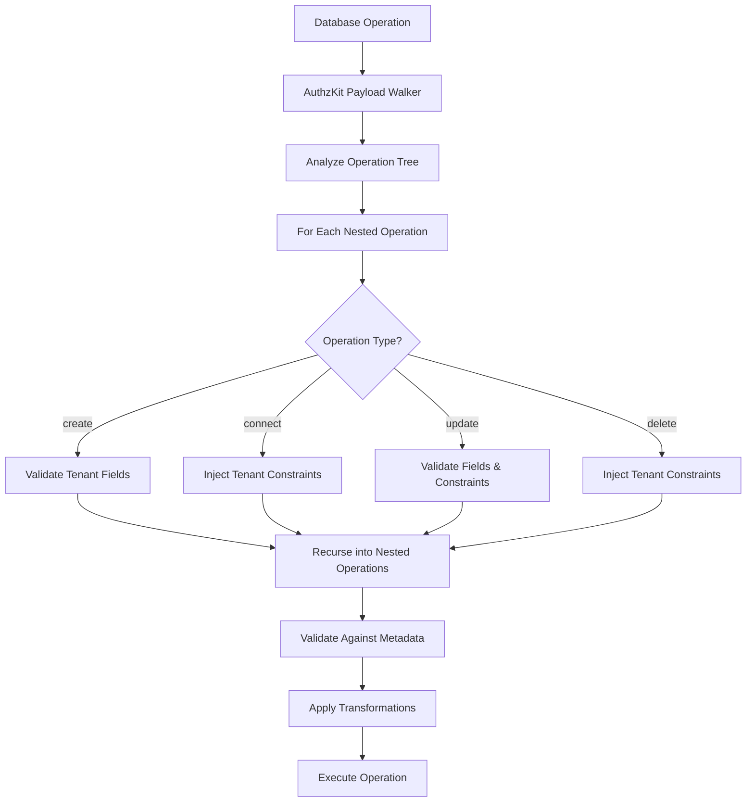

# Nested Operations

How AuthzKit validates complex nested database operations to ensure complete tenant isolation across all relationship layers.

## Overview

Nested operations are one of the most challenging aspects of multi-tenant security. A single database operation can create, update, connect, and delete data across multiple models and relationships. AuthzKit ensures that every nested operation respects tenant boundaries through recursive validation.

## The Nested Operation Challenge

Consider this seemingly simple operation:

```typescript
await prisma.todo.create({
  data: {
    title: 'Project Planning',
    author: {
      connect: { id: authorId }
    },
    tags: {
      create: [
        { name: 'urgent', color: '#ff0000' }
      ],
      connect: [
        { id: existingTagId }
      ]
    },
    comments: {
      create: [
        {
          content: 'Initial thoughts',
          author: {
            connect: { id: commentAuthorId }
          }
        }
      ]
    }
  }
});
```

**Hidden Security Challenges:**
- Does `authorId` belong to the current tenant?
- Does `existingTagId` belong to the current tenant?
- Does `commentAuthorId` belong to the current tenant?
- Are the created tags properly isolated?
- Are the created comments properly isolated?

AuthzKit automatically validates ALL of these operations recursively.

## How AuthzKit Validates Nested Operations



## Create Operations

### Simple Nested Creates

```typescript
// You write:
await tenantDb.todo.create({
  data: {
    title: 'New Task',
    tags: {
      create: [
        { name: 'priority', color: '#red' },
        { name: 'work', color: '#blue' }
      ]
    }
  }
});

// AuthzKit transforms to:
await prisma.todo.create({
  data: {
    tenantId: 'tenant-123',        // ← Auto-injected
    title: 'New Task',
    tags: {
      create: [
        {
          tenantId: 'tenant-123',   // ← Auto-injected
          tag: {
            create: {
              tenantId: 'tenant-123', // ← Auto-injected
              name: 'priority',
              color: '#red'
            }
          }
        },
        {
          tenantId: 'tenant-123',   // ← Auto-injected
          tag: {
            create: {
              tenantId: 'tenant-123', // ← Auto-injected
              name: 'work',
              color: '#blue'
            }
          }
        }
      ]
    }
  }
});
```

### Deep Nested Creates

```typescript
// Complex multi-level nesting
await tenantDb.user.create({
  data: {
    email: 'manager@company.com',
    name: 'Project Manager',
    todos: {
      create: [
        {
          title: 'Setup project',
          tags: {
            create: [
              {
                tag: {
                  create: {
                    name: 'management',
                    color: '#green'
                  }
                }
              }
            ]
          },
          comments: {
            create: [
              {
                content: 'Project kickoff notes',
                author: {
                  connect: { id: authorId } // Will be tenant-validated
                }
              }
            ]
          }
        }
      ]
    }
  }
});

// AuthzKit validates and injects tenant fields at every level:
// - User.create (level 1)
// - Todo.create (level 2)
// - TodoTag.create (level 3)
// - Tag.create (level 3)
// - Comment.create (level 3)
// - User.connect validation (level 4)
```

## Connect Operations

Connect operations are particularly security-sensitive as they link existing data across tenants.

### Simple Connects

```typescript
// You write:
await tenantDb.todo.update({
  where: { id: 123 },
  data: {
    tags: {
      connect: [
        { id: 456 },  // Existing tag - must validate tenant
        { id: 789 }   // Another existing tag
      ]
    }
  }
});

// AuthzKit transforms to:
await prisma.todo.update({
  where: {
    tenantId_id: {
      tenantId: 'tenant-123', // ← Auto-injected
      id: 123
    }
  },
  data: {
    tags: {
      connect: [
        {
          tenantId_id: {
            tenantId: 'tenant-123', // ← Auto-injected for validation
            id: 456
          }
        },
        {
          tenantId_id: {
            tenantId: 'tenant-123', // ← Auto-injected for validation
            id: 789
          }
        }
      ]
    }
  }
});
```

### Cross-tenant Connect Prevention

```typescript
// Malicious attempt to connect cross-tenant data
try {
  await tenantDb.todo.update({
    where: { id: 123 },
    data: {
      tags: {
        connect: [
          { id: 999 } // This tag belongs to a different tenant
        ]
      }
    }
  });
} catch (error) {
  // AuthzKit blocks this operation
  console.error('Cross-tenant connection blocked:', error.message);
}

// AuthzKit attempted to execute:
await prisma.todo.update({
  where: {
    tenantId_id: { tenantId: 'tenant-123', id: 123 }
  },
  data: {
    tags: {
      connect: [
        {
          tenantId_id: {
            tenantId: 'tenant-123', // ← Current tenant
            id: 999                  // ← Tag from different tenant
          }
        }
      ]
    }
  }
});
// Database returns no matching record - operation fails safely
```

## Update Operations

### Nested Updates

```typescript
// You write:
await tenantDb.user.update({
  where: { id: 1 },
  data: {
    name: 'Updated Name',
    todos: {
      update: [
        {
          where: { id: 456 },
          data: {
            title: 'Updated Todo',
            tags: {
              create: [
                { name: 'updated', color: '#orange' }
              ],
              connect: [
                { id: 789 }
              ]
            }
          }
        }
      ]
    }
  }
});

// AuthzKit transforms to include tenant validation at every level:
await prisma.user.update({
  where: {
    tenantId_id: {
      tenantId: 'tenant-123', // ← Where clause validation
      id: 1
    }
  },
  data: {
    tenantId: 'tenant-123',   // ← Data validation
    name: 'Updated Name',
    todos: {
      update: [
        {
          where: {
            tenantId_id: {
              tenantId: 'tenant-123', // ← Nested where validation
              id: 456
            }
          },
          data: {
            tenantId: 'tenant-123', // ← Nested data validation
            title: 'Updated Todo',
            tags: {
              create: [
                {
                  tenantId: 'tenant-123', // ← Created tag validation
                  tag: {
                    create: {
                      tenantId: 'tenant-123', // ← Deep nested validation
                      name: 'updated',
                      color: '#orange'
                    }
                  }
                }
              ],
              connect: [
                {
                  tenantId_id: {
                    tenantId: 'tenant-123', // ← Connection validation
                    id: 789
                  }
                }
              ]
            }
          }
        }
      ]
    }
  }
});
```

## Delete Operations

### Nested Deletes

```typescript
// You write:
await tenantDb.user.update({
  where: { id: 1 },
  data: {
    todos: {
      delete: [
        { id: 456 },  // Delete specific todo
        { id: 789 }   // Delete another todo
      ]
    }
  }
});

// AuthzKit transforms to:
await prisma.user.update({
  where: {
    tenantId_id: {
      tenantId: 'tenant-123',
      id: 1
    }
  },
  data: {
    todos: {
      delete: [
        {
          tenantId_id: {
            tenantId: 'tenant-123', // ← Ensures only current tenant's todos deleted
            id: 456
          }
        },
        {
          tenantId_id: {
            tenantId: 'tenant-123',
            id: 789
          }
        }
      ]
    }
  }
});
```

### Cascade Delete Protection

```typescript
// AuthzKit ensures cascade deletes respect tenant boundaries
await tenantDb.user.delete({
  where: { id: 1 }
});

// Transformed to:
await prisma.user.delete({
  where: {
    tenantId_id: {
      tenantId: 'tenant-123', // ← Only deletes if user belongs to tenant
      id: 1
    }
  }
});
// Related todos, comments, etc. only deleted if they belong to same tenant
```

## Many-to-Many Operations

Many-to-many relationships require special handling for junction tables:

### TodoTag Example

```typescript
// Schema:
// model TodoTag {
//   tenantId String
//   todoId   Int
//   tagId    Int
//   todo     Todo @relation(fields: [todoId, tenantId], references: [id, tenantId])
//   tag      Tag  @relation(fields: [tagId, tenantId], references: [id, tenantId])
//   @@id([tenantId, todoId, tagId])
// }

// You write:
await tenantDb.todo.update({
  where: { id: 123 },
  data: {
    tags: {
      create: [
        { tagId: 456 }  // Create junction record
      ],
      connect: [
        { id: 789 }     // Connect existing tag
      ]
    }
  }
});

// AuthzKit transforms to:
await prisma.todo.update({
  where: {
    tenantId_id: { tenantId: 'tenant-123', id: 123 }
  },
  data: {
    tags: {
      create: [
        {
          tenantId: 'tenant-123', // ← Junction table tenant validation
          tagId: 456
        }
      ],
      connect: [
        {
          tenantId_id: {
            tenantId: 'tenant-123', // ← Target validation
            id: 789
          }
        }
      ]
    }
  }
});
```

## Error Handling in Nested Operations

### Detailed Error Paths

AuthzKit provides precise error locations for nested operation failures:

```typescript
try {
  await tenantDb.todo.create({
    data: {
      title: 'Test',
      tags: {
        create: [
          { name: 'tag1', color: '#red' },
          { /* missing required field */ },  // Error here
          { name: 'tag3', color: '#blue' }
        ]
      }
    }
  });
} catch (error) {
  console.error(error.message);
  // TenantGuardError: Tenant guard: missing tenant field for Tag.create
  // Operation: todos.create.data.tags.create[1].tag.create
  //                                           ^^^
  //                                           Exact error location
}
```

### Partial Operation Failures

AuthzKit validates the entire operation tree before execution, preventing partial failures:

```typescript
// This entire operation will fail validation before any database changes
await tenantDb.todo.create({
  data: {
    title: 'Test Todo',
    tags: {
      create: [
        { name: 'valid', color: '#green' }     // Valid
      ],
      connect: [
        { id: 999 }  // Invalid - belongs to different tenant
      ]
    }
  }
});
// No partial data is created - operation fails atomically
```

## Performance Optimization

### Minimizing Nested Complexity

```typescript
// ❌ Very deep nesting - slower validation
await tenantDb.user.create({
  data: {
    email: 'user@example.com',
    todos: {
      create: [
        {
          title: 'Todo 1',
          tags: {
            create: [
              {
                tag: {
                  create: {
                    name: 'Tag 1',
                    subcategories: {
                      create: [
                        // Very deep nesting
                      ]
                    }
                  }
                }
              }
            ]
          }
        }
      ]
    }
  }
});

// ✅ Flatter operations - faster validation
const user = await tenantDb.user.create({
  data: { email: 'user@example.com' }
});

const tag = await tenantDb.tag.create({
  data: { name: 'Tag 1', color: '#blue' }
});

const todo = await tenantDb.todo.create({
  data: {
    title: 'Todo 1',
    authorId: user.id,
    tags: { connect: [{ id: tag.id }] }
  }
});
```

### Batch Operations

```typescript
// ✅ Use batch operations for multiple records
await tenantDb.tag.createMany({
  data: [
    { tenantId: currentTenantId, name: 'Tag 1', color: '#red' },
    { tenantId: currentTenantId, name: 'Tag 2', color: '#blue' },
    { tenantId: currentTenantId, name: 'Tag 3', color: '#green' }
  ]
});

// Rather than nested creates in a single operation
```

## Advanced Nested Patterns

### Conditional Nested Operations

```typescript
const updateData: any = {
  title: updatedTitle
};

// Conditionally add nested operations
if (newTags.length > 0) {
  updateData.tags = {
    create: newTags.map(tag => ({
      tag: {
        create: {
          name: tag.name,
          color: tag.color
          // tenantId auto-injected
        }
      }
    }))
  };
}

if (connectTags.length > 0) {
  updateData.tags = {
    ...updateData.tags,
    connect: connectTags.map(tag => ({ id: tag.id }))
    // tenant constraints auto-injected
  };
}

await tenantDb.todo.update({
  where: { id: todoId },
  data: updateData
});
```

### Transaction Support

```typescript
// AuthzKit works with Prisma transactions
await tenantDb.$transaction(async (tx) => {
  const user = await tx.user.create({
    data: { email: 'user@example.com' }
    // tenantId auto-injected
  });

  const todo = await tx.todo.create({
    data: {
      title: 'User Todo',
      authorId: user.id,
      tags: {
        create: [
          { tag: { create: { name: 'urgent', color: '#red' } } }
          // tenant fields auto-injected recursively
        ]
      }
    }
  });

  return { user, todo };
});
```

## Testing Nested Operations

### Comprehensive Test Cases

```typescript
describe('Nested Operations Security', () => {
  it('should validate deep nested creates', async () => {
    const tenant1Db = withTenantGuard(prisma, 'tenant-1');

    const result = await tenant1Db.user.create({
      data: {
        email: 'test@example.com',
        todos: {
          create: [
            {
              title: 'Test Todo',
              tags: {
                create: [
                  { tag: { create: { name: 'test', color: '#blue' } } }
                ]
              }
            }
          ]
        }
      }
    });

    // Verify all created objects belong to tenant-1
    expect(result.tenantId).toBe('tenant-1');
    expect(result.todos[0].tenantId).toBe('tenant-1');
    expect(result.todos[0].tags[0].tenantId).toBe('tenant-1');
    expect(result.todos[0].tags[0].tag.tenantId).toBe('tenant-1');
  });

  it('should block cross-tenant nested connects', async () => {
    const tenant1Db = withTenantGuard(prisma, 'tenant-1');
    const tenant2Db = withTenantGuard(prisma, 'tenant-2');

    // Create tag in tenant-2
    const tag = await tenant2Db.tag.create({
      data: { name: 'cross-tenant', color: '#red' }
    });

    // Try to connect from tenant-1 (should fail)
    await expect(
      tenant1Db.todo.create({
        data: {
          title: 'Malicious Todo',
          tags: { connect: [{ id: tag.id }] }
        }
      })
    ).rejects.toThrow();
  });
});
```

---

**Next: [Migration Guide](/tenant-guard/migration)** - Learn how to migrate existing applications to AuthzKit.